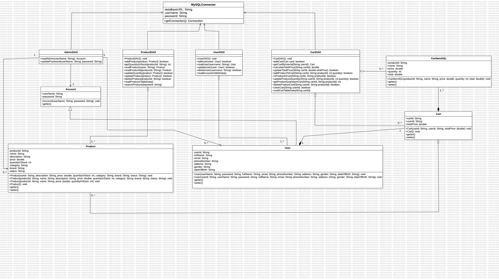
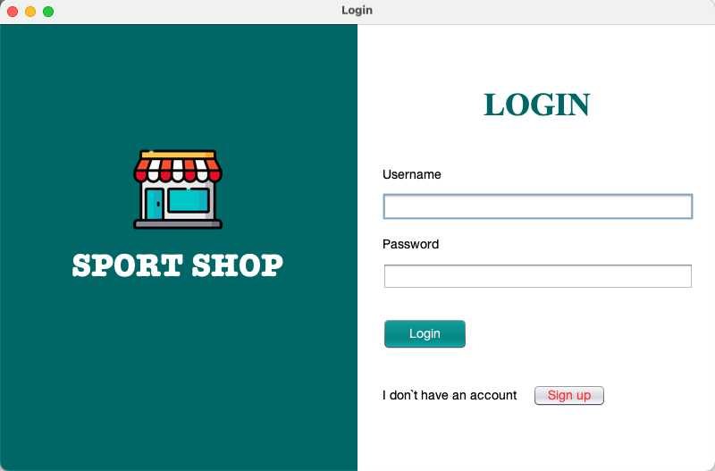
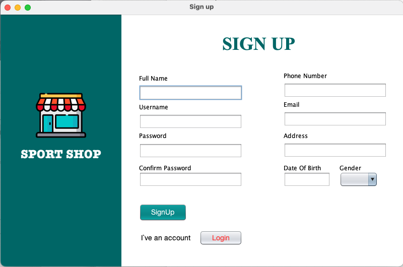
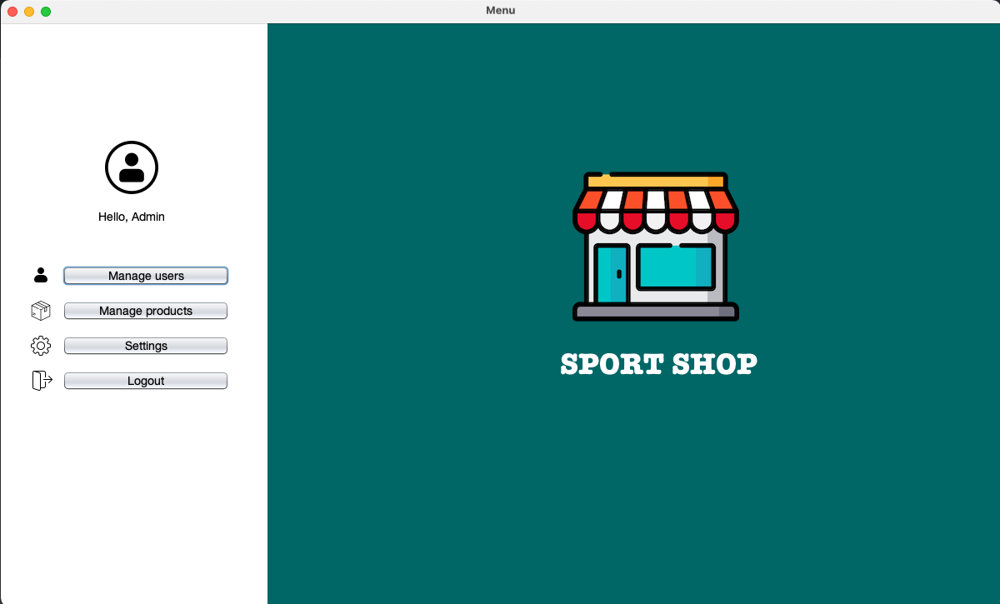
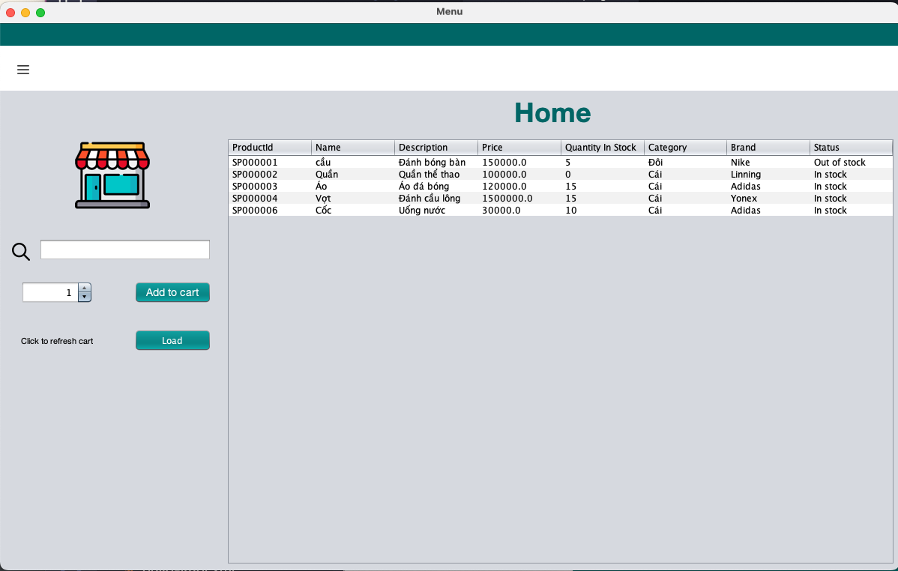
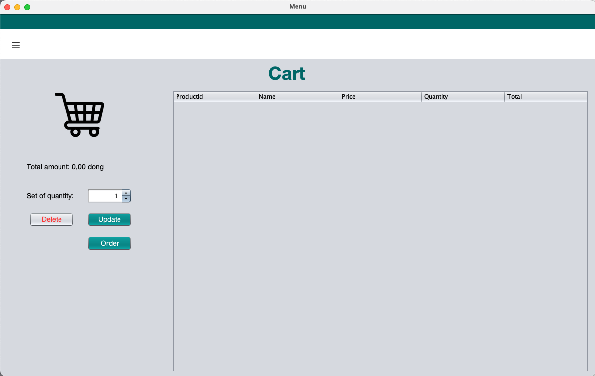
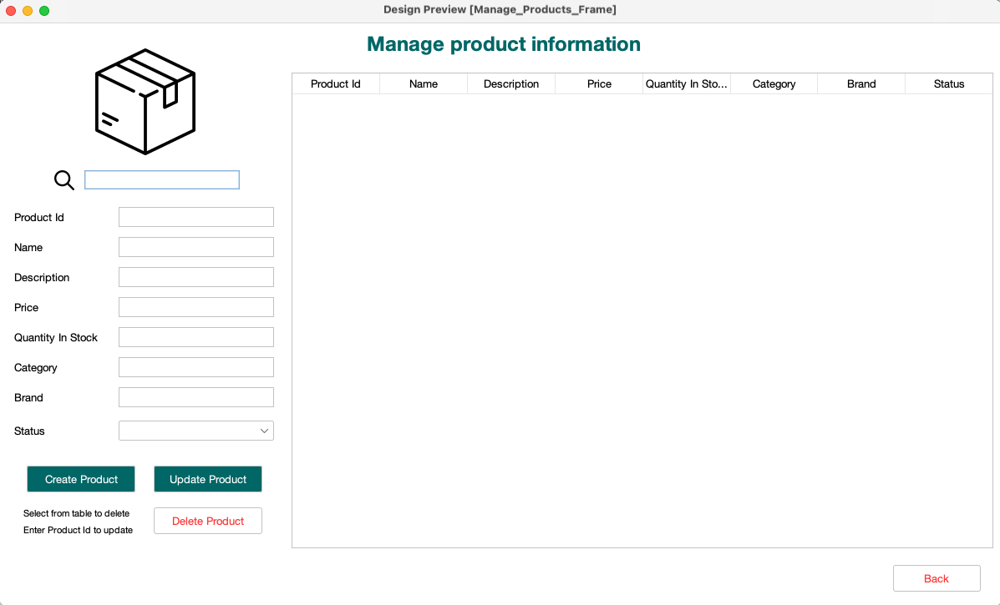
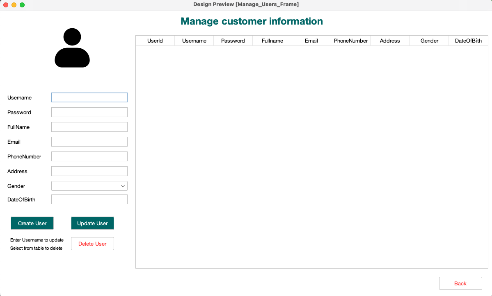
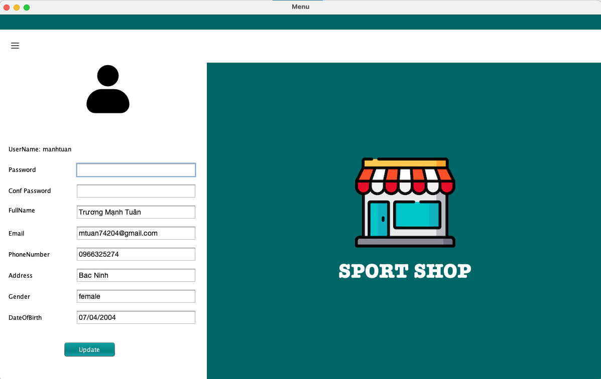

<div align="center">
    <h1>🚀 Welcome to the <strong>Sport Shop</strong> project!</h1>
    <p>Sport Shop is a project that aims to build Shopping Online </p>

</div>

Star ⭐ us if you like it!

---

## 📝 Table of Contents
- [x] Version 1: Add documentation for Week 1 + 2: <a href="https://m7xr-my.sharepoint.com/:w:/g/personal/azusavps_m7xr_onmicrosoft_com/EfB0BDUt6-ZLjn-qYLw3LnwBOsgurOHI_P9bqyF4oUEXYA?e=K5SIzV"><strong>Tài liệu Tuần 1 + 2</strong></a>
- [x] Version 2: Hoàn thiện code: các class cơ bản, các hàm cơ bản đã được nêu trong phần I. Phân tích thiết kế lớp và phần II. Biểu diễn các lớp của <a href="https://ptiteduvn-my.sharepoint.com/:w:/g/personal/giapcn_b22at102_stu_ptit_edu_vn/EXvmyKgse0xBoPYUXrj0ydsBE1GBFmvPU9C3vdy4VshZiA?e=xy9sMa"><strong>tài liệu</strong></a>.
- [x] Version 3: Tiếp tục triển khai code để kết nối với sql database, xử lý dữ liệu. Để kết nối ứng dụng Java với cơ sở dữ liệu MySQL, ta cần thực hiện 5 bước sau. Ví dụ này sử dụng MySQL, do đó cần biết các thông tin sau:
    1. Driver Class: com.mysql.jdbc.Driver
    2. Connection URL: jdbc:mysql://localhost:3306/sonoo
        ```
        jdbc: API
        mysql: Cơ sở dữ liệu
        localhost: Tên server hoặc địa chỉ IP (ở đây là localhost)
        3306: Cổng kết nối (mặc định của MySQL)
        sonoo: Tên cơ sở dữ liệu (thay sonoo bằng tên CSDL của bạn)
        ```
    3. Username: root (mặc định)
    4. Password: Mật khẩu được thiết lập khi cài đặt MySQL (ví dụ này dùng root)
    5. Tạo bảng: Trước khi tạo bảng, cần tạo cơ sở dữ liệu trước.
- [x] Version 4: Hoàn thiện code, xử lý dữ liệu, xử lý ngoại lệ, xử lý lỗi.
- [x] Version 5: Thêm phần giao diện, các action khi thao tác với giao diện. (Sử dụng Java Swing và JavaAWT)
- [x] Version 6: Cập nhật phần sử dụng sql database: Sử dụng database cloud để đồng bộ hóa dễ dàng. Sử dụng Azure SQL Database.
    Chi tiết tại: 
    1. <a href="https://docs.microsoft.com/en-us/azure/azure-sql/database/single-database-create-quickstart?tabs=azure-portal"><strong>Quickstart: Create a single database in Azure SQL Database using the Azure portal.</strong></a>
    2. <a href="https://learn.microsoft.com/vi-vn/sql/connect/jdbc/getting-started-with-the-jdbc-driver?view=sql-server-ver16"><strong>Getting started with the JDBC driver.</strong></a>

---
## 🚀 Features
[Biểu đồ UML](https://ptiteduvn-my.sharepoint.com/:i:/g/personal/giapcn_b22at102_stu_ptit_edu_vn/EbJQSVokBL5LggD5FajUkr4BnV2BDRIAFaX4xB7gY6_Ddw?e=AIhuPW)

## 📦 Installation
```bash
# Clone this project
$ git clone https://github.com/Zappu1204/sports-shop.git
```
```bash
# Open project in IDE
$ Open project in IDE (Apache NetBeans, IntelliJ, ...)
```
```bash
# Run project
$ Run project
```
## Screenshot
1. Login page

2. Register page (Customer)

3. Home admin page - Manage (Admin)

4. Home user page (Customer)

5. Cart user page (Customer)

6. Manage product page (Admin)

7. Manage user page (Admin)

8. Setting user (Admin)
